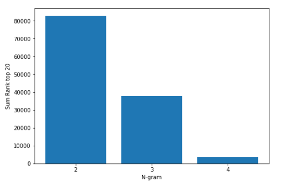

**Authors: Vishal Arya (G01241904), Anamika Singh (G01179029)**

## Table of Contents

1. [Introduction](#introduction&motivation)

1. [Data Retrieval](#data-retrieval)

1. [Exploratory Data Analysis](#exploratory-data-analysis)

1. [Data Preprocessing](#PreProcessing)

1. [Methodology](#methodolgy)
   
    1. [Benchmark Model](#benchmark-model)
    2. [Deep Learning Models](#deep-learning-models)
    
1. [Performance Evaluation](#performance-evaluation)

1. [Analysis of Results](#analysis-of-results)
	
	1. [Prediction on Labeled Tweets](#prediction-on-labeled-tweets)
	2. [Prediction on Unlabeled Tweets](#prediction-on-unlabeled-tweets)
	
1. [Conclusion](#conclusion)

1. [References](#references)

    
---

### Introduction & Motivation
Sentiment Analysis is the process of ‘computationally’ determining whether a piece of writing is positive, negative or neutral (https://monkeylearn.com/blog/sentiment-analysis-of-twitter/).  Commonly referred to as 'Opinion Mining', sentiment analysis lends itself to multiple applications across various facets of business, politics, and public action, among others.  In business, market research is conducted to understand customer feelings towards brands and products, and thus sentiment analysis plays a natural role of understanding customer receipt of a product given the multitude of opinions expressed by customers across various social media and public forums that exist, today.  With respect to politics, sina que non to a success of a politician's electability is understanding her reception among her various constituents, and there sentiment analysis is a critical tool for use, too.  Public action can use sentiment analysis to gauge the overall attitudes in society through inspection of various public forums, social media sites and blogs that reflect both society's attitudes in general as well as smaller, specific constituent attitudes.

Motivation in this study is to apply sentiment analysis via polarity of positive (1) or negative (0) tweets to US President Donald Trump tweets over the course of his presidential incumbency.  A natural application of classifying Trump's tweets as positive or negative would be in predicting the movement of the stock market as a function of Trump's overall tweet sentiments over a specific number of past precedent days coupled with other explanatory variables for overall market movement (S&P500) on a particular day in the future.  This is, however, a natural extension of this Study which is beyond the scope of Study's analysis.

### Data Retrieval

- We have sourced data from Kaggle. (https://www.kaggle.com/kazanova/sentiment140)
- These are human annotated tweets. (1 = positive, 0 = negative)

### Exploratory Data Analysis

- **Dataset Description**

  - Number of records - 100,000

  

  - Feature set : We have used text and target as features to train and validate the models.
  - Data Distribution: Both labels (positive and negative) are equally distributed in the dataset.

- **Data Exploration**

  **List of top 20 common words in dataset**

  

  **Top 20 common positive words**

  

  

  **Top 20 common negative words**

  

  - **Use of punctuations for each sentiment**
  
    
  
  - **Length of tweet **
  
    
    
    
    
  - **Word Cloud**
  
    
    
  - **N-gram Analysis**
  
    
  
  

### Pre-Processing

1. **Data Cleaning**
   
	- Removed stop words, punctuations, URLs, user mentions and extra spaces

	- Replaced English contractions with its meaning (hasn't -> has not)
   
   - Converted all words to lower case
   
   - Stemmed words to their base root form
   
2. **Model specific data pre-processing**

   - Pre-processing was common to all models, except BERT.

   - BERT requires minimum pre-processing. In this case we only removed URLs, user mentions and punctuations.

     ```python
     def text_preprocessing(text):
         """
         - Remove entity mentions (eg. '@united')
         - Correct errors (eg. '&' to '&')
         @param    text (str): a string to be processed.
         @return   text (Str): the processed string.
         """
         # Remove '@name'
         text = re.sub(r'(@.*?)[\s]', ' ', text)
     
         # Replace '&' with '&'
         text = re.sub(r'&', '&', text)
     
         # Remove trailing whitespace
         text = re.sub(r'\s+', ' ', text).strip()
     
         return text
     ```

     ​	

### Methodology

- ##### Benchmark Model
    1.  SVM
        - Tweet data was first tokenized using Word2Vec with maximum length
        15 and word vector dimension of 100.  The resultant matrix of tweets was [# tweets, 15, 100].  The mean of each embedding dimension was taken across tokenized word to prepare the data
        for use with the SVM algorithm resulting in final dataset dimension of [# tweets, 100]
        
        - The SVM algorithm was fit on the data with 80% training and 20% test.  A Radial Basis Function kernel was used to train the the model  
        
        - **The final resultant accuracy on the test data from SVM is 70.9%**
        
    1.  SVM with pre-trained embedding GLoVE
           - Twitter GLoVE word embedding vector of dim 100 was used for fitting tokenized words in the tweet data.  A dictionary was built on GLoVE vectorized word data first.  Max length of tweets was set to 15, which reflected roughly 80% quantile of tweet data length.  Each token was then vectorized using the GLoVE dictionary and if the word was not found its vector was set to the 0 vector.  To prepare the dataset for SVM, the mean per token was taken and the resultant matix dimension was [# tweets, 100]
           
        - The SVM algorithm was fit on the data with 80% training and 20% test.  A Radial Basis Function kernel was used to train the the model  
        
        - **The final resultant accuracy on the test data from SVM with GLoVE is 70.32%**
    
- ##### Deep Learning Models

    ***We have used PyTorch and TorchText extensively to build deep learning models***.

    1. CNN

      1. CNN 1D
      	- CNN 1D model was created to pretrain embeddings to be fed into the CNN 2D model for sentiement analysis.  Kernel sizes of [2,3,4] were used to train the model embeddings of 100 dimension.  These kernel sizes reflect the bigram, trigram and 4gram and the model strides over kernel sizes 2,3,4 as it trains the weights. 
    
    	  	
    
      	class CNN(nn.Module):
      	    def __init__(self, vocab_size, embedding_dim, n_filters, output_dim, 
      	                 dropout, pad_idx, k_size):
              
      	        super().__init__()
      	                
      	        self.embedding = nn.Embedding(vocab_size, embedding_dim, padding_idx = pad_idx)
      	        self.cnn = nn.ModuleList([nn.Conv1d(in_channels = embedding_dim, 
      	                                              out_channels = n_filters, 
      	                                              kernel_size = fs) 
      	                                    for fs in k_size
      	                                    ])
      	        self.relu = nn.ReLU()
      	        self.dropout = nn.Dropout(dropout)
      	        self.fc = nn.Linear(len(k_size)*n_filters, output_dim) #replaced with avg pool torch.mean
      	        
    	```
    


  For purposes of model training, the loss was defined as Binary Cross Entropy Loss given there are only 2 classes and the Adam optimizer was used.  Following training of the model, word embeddings were plotted using PCA analysis with the first 2 principal component vectors as axes (top 50 words labeled):

​    

  ​	  	
  ​	
  1. CNN 2D
     
     - CNN 2D network was created for sentiment analysis using multiple kernel sizes to reflect bigram, trigram and 4-gram relationships in the tweet data.  An embedding initial layer of 100 dimension was specified, following by 3 convolution layers to convolve over kernel sizes respectively equal to [2,3,4] N-gram analysis.  A linear layer was further connected to the output of the convulation layers and a dropout layer was instantiated as part of regularization efforts.  The forward propagation method is printed below:
      
     ```python
         def forward(self, text):
                     
                     #text = [batch size, sent len]
         
                     embedded = self.embedding(text)
         
                     #embedded = [batch size, sent len, emb dim]
         
                     embedded = embedded.unsqueeze(1)
         
                     #embedded = [batch size, 1, sent len, emb dim]
         
                     conved = [F.relu(conv(embedded)).squeeze(3) for conv in self.convs]
         
                     #conved_n = [batch size, n_filters, sent len - filter_sizes[n] + 1]
         
                     pooled = [F.max_pool1d(conv, conv.shape[2]).squeeze(2) for conv in conved]
         
                     #pooled_n = [batch size, n_filters]
         
                     cat = self.dropout(torch.cat(pooled, dim = 1))
         
                     #cat = [batch size, n_filters * len(filter_sizes)]
                     
                     cat = self.fc(cat)
                     
                     cat = torch.sigmoid(cat)
                     
                     return cat
     ```

  MaxPooling was used to reduce dimensionality and reduce overfitting of the network followed by a dropout layer whose dropout probabaility was optimized utilizing a heuristic grid search algorithm.  A sigmoid layer was called on the final linear layer with output dimension = 1 to determine the probability of positive (1) or negative (0) sentiment classification of the tweet

  - The model was run with pre-trained embeddings from CNN1D embedding layers fit on the vocabulary.  However accuracy was not shown to increase using pre-trained embeddings and thus for purposes of optimization of the CNN 2D network the network would train its own embedding weights during model training

  1. CNN 2D Heuristic Optimization
     
     - Grid search was conducted on the following parameters: Dropout probability %, filter size, embedding vector dimension, and optimizer selection (Adam or RMSProp)
     
       
     
       ```python
           GRID_DROPOUT = [.5, .75, .4]
       GRID_FILTERS = [32, 64, 128, 16]
           GRID_EMBEDDINGS = [None]
           GRID_EMBED_DIM = [100,50,300]
           GRID_OPT_SELECT = ["Adam","RMSprop"]
           
           #create list instantiated models with param tuning
           
           GRID_TOTAL = [] 
           
           for perm in itertools.product(GRID_DROPOUT, GRID_FILTERS, GRID_EMBEDDINGS, GRID_EMBED_DIM, GRID_OPT_SELECT):
               GRID_TOTAL.append(perm)
           
               
           len(GRID_TOTAL)
           
           GRID_TOTAL[0] # dropout x filter x embedding x embed_dim x optimizer_type
           
           GRID_MODELS = []
           GRID_OPT = []
           
           #create models list
           
           for i in range(len(GRID_TOTAL)):
               
               DROPOUT = GRID_TOTAL[i][0]
               N_FILTERS = GRID_TOTAL[i][1]
               PRETRAINED_EMBEDDINGS = GRID_TOTAL[i][2]
               EMBEDDING_DIM = GRID_TOTAL[i][3]
               
               GRID_MODELS.append(CNN_2d(INPUT_DIM, EMBEDDING_DIM, N_FILTERS, FILTER_SIZES, OUTPUT_DIM, DROPOUT, PAD_IDX, PRETRAINED_EMBEDDINGS))
               GRID_OPT.append(eval("optim."+GRID_TOTAL[i][4])(GRID_MODELS[i].parameters()))
       ```
     
         - Optimization was measured using Accuracy statistic, 10 epochs were run with batch size of 1000 per each grid search tuned model.  Gradient clipping was set to OFF because no high magnitude gradients during backpropagation, defined as gradient magnitude > 5 was found:
     
       ``` python
           GRID_TRACKER = []
       
           #gradient does not exhibit high magnitudes, thus clip set to FALSE
           #pre-trained embeddings from CNN1d exhibited no accuracy benefit, thus self-train embeddings
           train_options = dict(EPOCHS=10, clip=False, KERN_SET=KERNEL_SIZE)
           
           for i in range(len(GRID_MODELS)):
               print(" \n Running Grid search model %d of %d" % (i+1, len(GRID_MODELS)))
               temp_val = train_val(GRID_MODELS[i],GRID_OPT[i],train_options)
               GRID_TRACKER.append(np.max([temp_val[x][1] for x in range(len(temp_val))]))
           
       ```
     
         
     
     - The resulting histogram of the accuracy results across all tested models is below.  The overall mean was 75% and standard deviation of .005% indicating small tails:
     
       
     
     - Given the relatively clustered model performances around the mean of 75%, the optimized CNN2D model with the following parameters were chosen:
     
       - **Embedding Dim = 100, Dropout Probability = 50%, Filter Size = 32, Kernel Size = [2,3,4]**
     
       - The final model settings were trained on 10 epochs using batch size of 1000 resulting in best validation accuracy of approximately **75%**
     
         
  
1. **Recurrent Neural Network**
   
    1. LSTM self trained
    
    1.  LSTM with Glove as embeddings
    
- Data Preparation

  - The first step in getting data ready for modeling was to define the Fields and split the data into train, validation and test sets.

  - We have used packed padded sequences, which makes the model process only non-padded elements in a given sequence and for padded elements output will be zero tensor.

  - Tweet text is split into discrete tokens using spaCy tokenizer.

    ```python
    TEXT = data.Field(tokenize='spacy', lower=True, include_lengths= True)
    LABEL = data.LabelField(dtype=torch.float)
    ```

- Build Vocabulary

  - Next, we build vocabulary which is effectively a look up table where every unique word in dataset has a corresponding integer value. 
  - Since size of our dataset is large, we have limited the vocab size to 30,000. This will take most common words (30000) to build the vocabulary.

- Train the model on mini-batches

  - We have used BucketIterator, which returns a batch of similar length examples minimizing the amount of padding per example.

- Model Architecture

  

  - The first layer is Tokenize, which is a mandatory step of converting each unique word in a sentence to integers. Dimension for this layer is same as vocabulary size.
  - Next, we have Embedding layer that converts tokens into embeddings of specific size.
  - LSTM layer includes hidden state dimensions and number of layers.
  - The output from Fully connected Layer is passed as input to Sigmoid activation which will turn all the values between 0 and 1.

- Instantiate and Train the Model

  - Model is instantiated with hyperparameters

    ```python
    INPUT_DIM = len(TEXT.vocab)
    EMBEDDING_DIM = 300
    HIDDEN_DIM = 256
    OUTPUT_DIM = 1
    # 2 layers of biLSTM
    N_LAYERS = 2
    BIDIRECTIONAL = True
    # Dropout probability
    DROPOUT = 0.6
    # Get pad token index from vocab
    PAD_IDX = TEXT.vocab.stoi[TEXT.pad_token]
    
    model = LSTM(INPUT_DIM,
                EMBEDDING_DIM,
                HIDDEN_DIM,
                OUTPUT_DIM,
                N_LAYERS,
                BIDIRECTIONAL,
                DROPOUT,
                PAD_IDX)
    ```

    - Regularization: Dropout probability is set to 0.6 to avoid overfitting.
    - We have used Binary Cross Entropy Loss. BCE loss is specifically designed to work with a single sigmoid output.
    - Optimizer: Adam with learning rate 0.001
    - Clip: To prevent exploding of gradients, we have specified gradient clipping value as 5.

- Accuracy Plots

  

- **LSTM with Glove as embeddings**

  Data preparation is similar to self trained LSTM, the only difference here is we will use pre-trained word embeddings instead of having embeddings initialized randomly.

  We have used "glove.6B.100d". Glove is the algorithm that calculates vectors, 6B indicates these vectors were trained on 6 billion tokens and 100d is the dimension size of vectors.

  TorchText initializes the vocabulary via a Gaussian distribution, when **unk_init** is specified to **torch.Tensor.normal_**

  ```python
  MAX_VOCAB_SIZE = 30000
  TEXT.build_vocab(train_data, 
                   max_size = MAX_VOCAB_SIZE,
                   vectors = "glove.6B.100d",
                   unk_init = torch.Tensor.normal_)
  
  LABEL.build_vocab(train_data)
  TEXT.vocab.freqs.most_common(10)
  ```

  **Model Implementation**

  - In this implementation we will explicitly specify the model to not learn the embedding for "<pad>" token as they are not relevant in sentiment prediction.

  - Similar to self trained LSTM, we have instantiated model with new parameters and arguments for the number of layers, bidirectionality and dropout probability.

  - Embedding dimension is equal to that of the pre-trained GLoVE vectors to ensure pre-trained vectors are loaded into the model.

    ```python
    INPUT_DIM = len(TEXT.vocab)
    # dim must be equal to the dim of pre-trained GloVe vectors
    EMBEDDING_DIM = 100
    HIDDEN_DIM = 100
    OUTPUT_DIM = 1
    # 2 layers of biLSTM
    N_LAYERS = 2
    BIDIRECTIONAL = True
    # Dropout probability
    DROPOUT = 0.4
    # Get pad token index from vocab
    PAD_IDX = TEXT.vocab.stoi[TEXT.pad_token]
    
    # Create an instance of LSTM class
    model = LSTM(INPUT_DIM,
                EMBEDDING_DIM,
                HIDDEN_DIM,
                OUTPUT_DIM,
                N_LAYERS,
                BIDIRECTIONAL,
                DROPOUT,
                PAD_IDX)
    ```

      

  - The final addition to model implementation is copying pre-trained word embeddings and replace the initial weights of the embedding layer with pre-trained embeddings.

    ```python
    model.embedding.weight.data.copy_(pretrained_embeddings)
    
    tensor([[ 0.4301, -1.0782,  0.0548,  ...,  0.9136,  1.7360,  0.1787],
            [ 0.2079,  1.2385,  0.1488,  ...,  1.3275,  2.0824,  0.1242],
            [-0.0465,  0.6197,  0.5665,  ..., -0.3762, -0.0325,  0.8062],
            ...,
            [ 0.4727, -0.7132,  0.6358,  ..., -0.7714, -0.1937, -0.3705],
            [-0.4105, -0.7782, -0.2961,  ...,  0.0090, -0.2415,  0.0184],
            [-0.2424,  0.4024,  0.6598,  ...,  0.3556, -0.2883,  0.3972]])
    ```

  - Training steps are same as self trained LSTM.

  - Accuracy Plots

    

- ##### BERT (Bidirectional Encoder Representation for Transformers) 

  - Like, other deep learning models, BERT aims to solve NLP-related tasks. The difference between BERT and other deep learning models is BERT has additional embedding layers in the form of Segment Embeddings and Position Embeddings.
  
  - Brief information about each embedding layer.
  
    1. Token Embeddings : The role of this layer is to transform words into vector representations of fixed dimension. Each word is represented as a 768-dimensional vector.
  
    2. Segment Embeddings: This layer helps BERT in distinguishing inputs based on semantic similarity. For example, input is "i like cats, i like dogs", segment embedding will tokenize the text in a way that model treats this as two different inputs. input 1 will be "i like cats" and input 2, "i like dogs".
  
    3. Position Embeddings: BERT consists of stack of Transformers and broadly speaking, Transformers do not encode sequential nature of their inputs. Having position embeddings allows BERT to understand that given an input text like, "I think, therefore I am" , the first "I" should not have same vector representation as second.
  
       


#### Performance Evaluation

1. **Initial Results**

   | Model                | pre-trained Vectors | Accuracy (Test set) |
   | -------------------- | ------------------- | ------------------- |
   | CNN                  | -                   | 73%                 |
   | LSTM (Bidirectional) | -                   | 79.8%               |
   | LSTM (Bidirectional) | GLoVE               | 79%                 |
   | BERT (Transformers)  | bert-base-uncased   | 82%                 |

   

2. **Results post Hyperparameter tuning**

   - We have used gridsearch to find optimal combination of hyperparameters for all the models. 

   - List of hyperparameters tuned for LSTM

     1. Learning rate
     2. Dropout Probability
     3. Hidden dimension
     4. Embedding dimension
     5. Optimizer (Adam Vs RMSprop)

   - List of hyperparameters tuned for BERT

     1. Learning Rate
     2. Number of epochs

     **Optimized Results**

     | Model | pre-trained Vectors | Accuracy (Test set) |
     | ----- | ------------------- | ------------------- |
     | CNN   | -                   | 75%                 |
     | LSTM  | -                   | 80.8%               |
     | LSTM  | GLoVE               | 80.5%               |
     | BERT  | bert-base-uncased   | 84.5%               |

     

#### Analysis of Results

1. **Unlabeled Dataset**

   - To review performance of our models, we have retrieved set of tweets by US President Donald Trump. These are unlabeled tweets.

   - We have labeled the tweets as positive or negative using TextBlob. TextBlob is a python library and offers a simple API to access its methods and perform basic NLP tasks. 

   - Labels annotated using TextBlob are compared with the labels predicted by the model.

   - **We have around 70% of positive tweets and around 30% negative as per TextBlob**. We will use this as reference to compare prediction by our models.
   
   - Below table shows performance of model in predicting sentiment.
   
     | Model           | Prediction %                                  |
   | --------------- | --------------------------------------------- |
     | LSTM            | 63% positive tweets and 37% negative tweets   |
     | LSTM with GLoVE | 70.68% positive and 29.31% negative           |
     | BERT            | 62% positive tweets and 38% negative tweets   |
   | CNN 2d          | 71% positive tweets and 28.6% negative tweets |
     
      
     
     **Sample of positive/negative tweets predicted by the model**
     
     | Tweet                                                        | Prediction | True Label (TextBlob) |
     | ------------------------------------------------------------ | ---------- | --------------------- |
     | i was thrilled to  be back in the great city of charlotte, north carolina with thousands of  hardworking american patriots who love our country, cherish our values,  respect our laws, and always put america first! thank you for a wonderful  evening!! kag2020 | 0.983126   | Positive              |
     | getting a little  exercise this morning!                     | 0.91164    | Negative              |
     | more voter fraud  ...                                        | 0.343907   | Positive              |
     | the unsolicited  mail in ballot scam is a major threat to our democracy, & amp; the  democrats know it . almost all recent elections using this system, even  though much smaller & amp;  with  far fewer ballots to count, have ended up being a disaster . large numbers of  missing ballots & amp; fraud! | 0.147174   | Positive              |
     | ... based on  decisions being rendered now, this list is more important than ever before  (second amendment, right to life, religous liberty, etc .) – vote 2020! | 0.94707    | Positive              |
     | president: the 20  most dangerous american cities are democrat run | 0.846576   | Negative              |
     | live:  president  gives an update on  coronavirus testing strategy | 0.921976   | Positive              |
     | sleepy joe thought  this was ok . not me!                    | 0.268652   | Positive              |
     
     - From the above table, we observe that sequential model is taking context into consideration to predict sentiment.
     - Example: getting a little  exercise this morning! is classified as negative by textBlob method, but as per model it is a positive sentiment.
     - Example: sleepy joe thought  this was ok . not me!. Here again textBlob has classified the tweet as Positive whereas as per model its negative.
     - Sequential models like LSTM, BERT are performing better than textBlob in classifying text sentiment.

#### Conclusion & Future work

- We have implemented machine learning, deep learning and transformer based models. Based on the accuracy results obtained, we can conclude BERT performs best in predicting accurate results.
- BERT gives accuracy of 85% on sentiment140 test data. This is because BERT takes position of word/text into consideration along with context. 
- In addition to predicting sentiment on labeled sentiment140 dataset, we evaluated performance of our models on unlabeled tweets. 
- LSTM with pre-trained GLoVE embeddings performs best in predicting sentiment on unlabeled tweets. Since we have initialized our embeddings using pre-trained vectors, instead of having them initialized randomly using training data.
  The theory is that these pre-trained vectors already have words with similar semantic meaning close together in vector space, e.g. “terrible”, “awful”, “dreadful” are nearby. This gives our embedding layer a good initialization as it does not have to learn these relations from scratch.
  Sentiment prediction is more accurate with sequential deep learning models, like LSTM and BERT in comparison to TextBlob. TextBlob marks the tweet as positive or negative based on word vectors whereas sequential models take context into consideration.
- In future, we would like to take subjectivity of tweet/text into consideration when predicting sentiment.

#### References

​		https://towardsdatascience.com/sentiment-analysis-using-lstm-step-by-step-50d074f09948

 	   https://medium.com/@_init_/why-bert-has-3-embedding-layers-and-their-implementation-details-9c261108e28a

 	   https://arxiv.org/pdf/1810.04805.pdf

